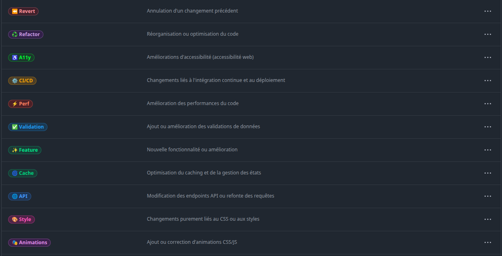

# **LabelSync Pro**

``` Aperçu des labels ```



---

# 🇫🇷 Version Française

## Description

`labelsync-pro` est un outil d'automatisation GitHub qui synchronise un ensemble standardisé d'étiquettes (labels) sur vos repositories GitHub. Il est conçu pour maintenir une cohérence visuelle et fonctionnelle à travers tous vos projets en appliquant automatiquement un ensemble prédéfini d'étiquettes au dernier repository créé.

## Fonctionnalités

- **Synchronisation automatique des étiquettes** : Applique automatiquement un ensemble standardisé d'étiquettes au dernier repository GitHub créé.
- **Exécution programmée** : S'exécute automatiquement chaque jour à 19h15 ou peut être déclenché manuellement.
- **Optimisation des performances** : Ne traite que le repository le plus récemment créé et ignore ceux qui ont déjà toutes les étiquettes requises.
- **Gestion intelligente des étiquettes** : Supprime les étiquettes obsolètes et ajoute uniquement les nouvelles étiquettes manquantes.
- **Personnalisation facile** : Configuration simple via un fichier JSON pour définir vos propres étiquettes.

## Étiquettes prédéfinies

Le workflow inclut un ensemble complet d'étiquettes prédéfinies pour différents types de contributions :

- 🛠️ Chore : Maintenance ou tâches techniques
- ✨ Feature : Nouvelle fonctionnalité ou amélioration
- 🐛 Fix : Correction de bugs ou d'erreurs
- 🚑 Hotfix : Corrections urgentes en production
- ♻️ Refactor : Réorganisation ou optimisation du code
- 🚀 Release : Livraison d'une version stable
- 📦 Update : Mises à jour ou modifications générales
- ⚙️ CI/CD : Changements liés à l'intégration continue et au déploiement
- Et bien d'autres...

## Installation

1. **Cloner ce repository** :
   ```bash
   git clone https://github.com/djoudj-dev/labelsync-pro.git
   ```

2. **Configurer le token GitHub** :
   - Créez un token GitHub avec les permissions `repo` complètes
   - Ajoutez ce token comme secret dans votre repository sous le nom `LABELGITHUB_TOKEN`

3. **Personnaliser les étiquettes (optionnel)** :
   - Modifiez le fichier `.github/config/labels.json` selon vos besoins

## Utilisation

### Exécution automatique

Le workflow s'exécute automatiquement chaque jour à 19h15 pour synchroniser les étiquettes sur votre repository le plus récemment créé.

### Exécution manuelle

Vous pouvez également déclencher le workflow manuellement :

1. Accédez à l'onglet "Actions" de votre repository GitHub
2. Sélectionnez le workflow "Synchronisation des Labels sur le Dernier Repo Créé"
3. Cliquez sur "Run workflow"

## Configuration

Vous pouvez personnaliser les étiquettes en modifiant le fichier `.github/config/labels.json`. Chaque étiquette est définie avec les propriétés suivantes :

```json
{
  "name": "Nom de l'étiquette",
  "description": "Description de l'étiquette",
  "color": "code couleur hexadécimal sans #"
}
```

## Exemple de configuration

```json
[
  { "name": "🐛 Bug", "description": "Quelque chose ne fonctionne pas", "color": "d73a4a" },
  { "name": "📚 Documentation", "description": "Améliorations ou ajouts à la documentation", "color": "0075ca" }
]
```

## Contribution

Les contributions sont les bienvenues ! N'hésitez pas à ouvrir une issue ou à soumettre une pull request pour améliorer ce projet.

## Licence

Ce projet est libre d'utilisation.

---

# 🇺🇸 English Version

## Description

`labelsync-pro` is a GitHub automation tool that synchronizes a standardized set of labels across your GitHub repositories. It's designed to maintain visual and functional consistency across all your projects by automatically applying a predefined set of labels to your most recently created repository.

## Features

- **Automatic label synchronization**: Automatically applies a standardized set of labels to the latest created GitHub repository.
- **Scheduled execution**: Runs automatically every day at 7:15 PM or can be triggered manually.
- **Performance optimization**: Only processes the most recently created repository and ignores those that already have all required labels.
- **Smart label management**: Removes obsolete labels and adds only missing new labels.
- **Easy customization**: Simple configuration via a JSON file to define your own labels.

## Predefined Labels

The workflow includes a comprehensive set of predefined labels for different types of contributions:

- 🛠️ Chore: Maintenance or technical tasks
- ✨ Feature: New functionality or enhancement
- 🐛 Fix: Bug fixes or error corrections
- 🚑 Hotfix: Urgent production fixes
- ♻️ Refactor: Code reorganization or optimization
- 🚀 Release: Stable version delivery
- 📦 Update: Updates or general modifications
- ⚙️ CI/CD: Changes related to continuous integration and deployment
- And many more...

## Installation

1. **Clone this repository**:
   ```bash
   git clone https://github.com/djoudj-dev/labelsync-pro.git
   ```

2. **Configure GitHub token**:
   - Create a GitHub token with full `repo` permissions
   - Add this token as a secret in your repository under the name `LABELGITHUB_TOKEN`

3. **Customize labels (optional)**:
   - Modify the `.github/config/labels.json` file according to your needs

## Usage

### Automatic execution

The workflow runs automatically every day at 7:15 PM to synchronize labels on your most recently created repository.

### Manual execution

You can also trigger the workflow manually:

1. Go to the "Actions" tab of your GitHub repository
2. Select the "Label Synchronization on Latest Created Repo" workflow
3. Click "Run workflow"

## Configuration

You can customize labels by modifying the `.github/config/labels.json` file. Each label is defined with the following properties:

```json
{
  "name": "Label name",
  "description": "Label description",
  "color": "hexadecimal color code without #"
}
```

## Configuration Example

```json
[
  { "name": "🐛 Bug", "description": "Something isn't working", "color": "d73a4a" },
  { "name": "📚 Documentation", "description": "Improvements or additions to documentation", "color": "0075ca" }
]
```

## Contributing

Contributions are welcome! Feel free to open an issue or submit a pull request to improve this project.

## License

This project is free to use.
